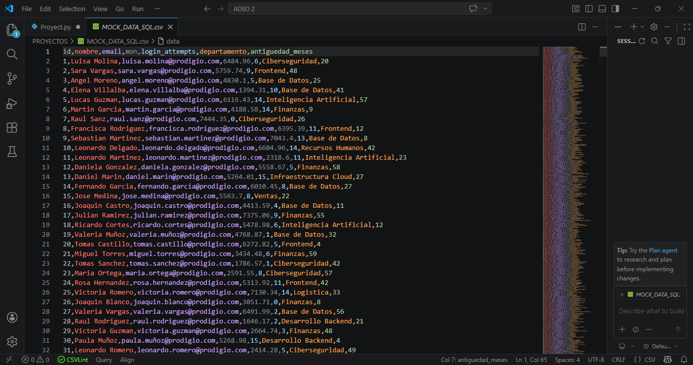
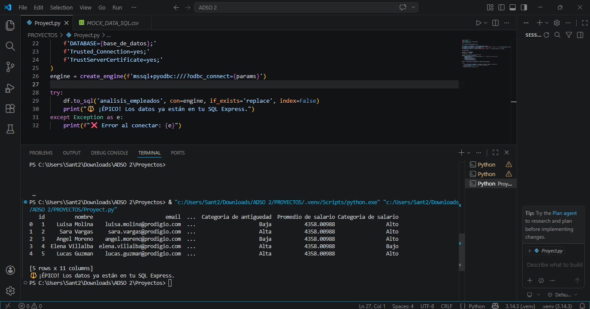
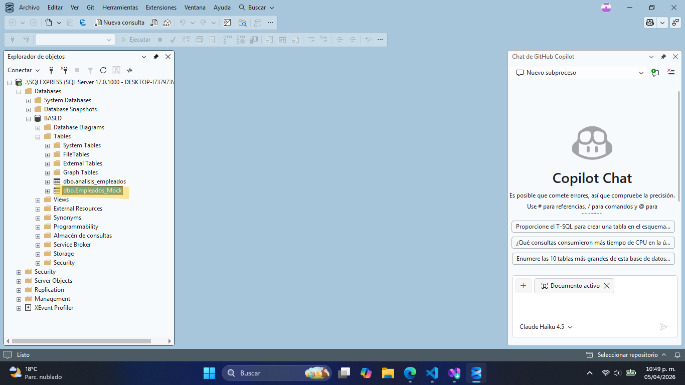

# 📊 Proyecto End-to-End: Pipeline de Análisis de Datos (ADSO)

## 🎯 Resumen del Proyecto
Este ecosistema de datos fue desarrollado íntegramente el **5 de abril**, como resultado de un proceso de **aprendizaje autónomo intensivo iniciado el 12 de marzo**. En menos de un mes, logré integrar herramientas de programación, bases de datos y visualización para resolver un problema real de infraestructura local.

---

## 📂 Fase 1: Datos Crudos (Dataset)
Iniciamos con un archivo plano que contiene la información sin procesar. Este es el punto de partida de nuestra ingesta.

> **Visualización del archivo CSV:**
> 

---

## 🐍 Fase 2: Procesamiento y ETL (VS Code + Python)
Para este paso, utilicé **Desarrollo asistido por IA** para optimizar la escritura de los scripts de limpieza en Python, garantizando una carga eficiente de los registros hacia el motor de base de datos.

> **Terminal de VS Code (Confirmación de envío a SQL):**
> 
> *Aquí se observa el log de ejecución del 5 de abril, confirmando la inserción de datos.*

---

## 🗄️ Fase 3: Persistencia en SQL Server
Una vez procesados, los datos se alojan en una instancia local de **SQL Server Express**. Esta etapa garantiza la integridad de los datos y permite un modelado relacional profesional.

> **Ubicación de los datos en SQL Server:**
> 
> *Consulta de verificación de los registros importados exitosamente.*

---

## 📊 Fase 4: Business Intelligence (Power BI)
**Proceso 100% Manual:** La conexión entre SQL Server y Power BI, el modelado de medidas DAX y el diseño de la interfaz fueron realizados con mis propios conocimientos técnicos adquiridos desde marzo.

> **Resultado Final - Dashboard Estratégico:**
> 
> *Dashboard con diseño moderno (Arial Black / Sombras), filtros dinámicos y métricas clave de negocio.*

---

## 🛠️ Desafíos y Logros
Este proyecto es el testimonio de mi capacidad de **autoaprendizaje y resolución de problemas**. Ante la limitación de cuentas empresariales, diseñé este puente técnico que hoy funciona como un sistema de BI profesional.

---
**Desarrollado por:** DAVID SANTIAGO VELASQUEZ LASPRILLA
